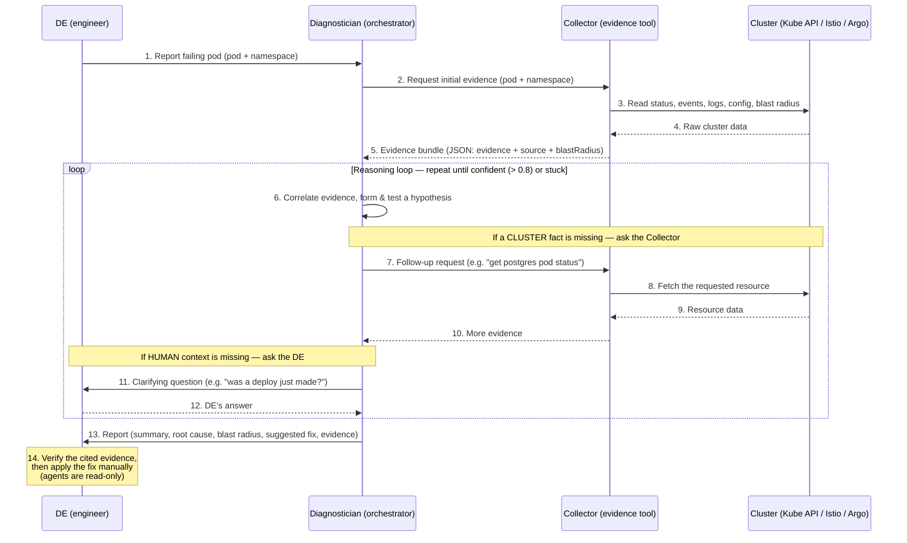

# Kagent design

> This is the design for **one candidate only — the kagent agent approach**. It describes how kagent *would* work *if chosen*. It is **not** a decision that an agent is the answer — the tool comparison in [`../rfc-ai-cluster-tooling.md`](../rfc-ai-cluster-tooling.md) drives the recommendation. Everything kagent-specific is deliberately kept here, out of the RFC, so the comparison stays open.

## Table of contents

- [Workflow](#workflow--how-a-de-uses-it)
- [Architecture](#architecture-collector--diagnostician)
- [Success criteria](#success-criteria)
- [Key concerns & guardrails](#key-concerns--guardrails)
- [Limitations](#limitations)
- [Appendix A — rough work for kagent agent definitions](#appendix-a--rough-work-for-kagent-agent-definitions)

## Workflow — how a DE uses it

The DE reports a failing pod to the **Diagnostician** (the orchestrator). The Diagnostician calls the **Collector** — its evidence-gathering tool, and the only agent that touches the cluster — gathers what it needs, reasons over it, and returns a root cause + suggested fix with the evidence to verify. The DE re-enters only if the Diagnostician needs context that the cluster cannot provide, and at the end.



**Zooming into the loop** — each pass, the Diagnostician needs at most one more thing, and gets it one of two ways:

- **Missing a cluster fact?** → ask the **Collector** (steps 7–10)
- **Missing human context the cluster can't provide?** → ask the **DE** (steps 11–12)

Either answer feeds back into the next correlation (step 6).

A simple failure — e.g. a missing ConfigMap already visible in the first evidence bundle — needs neither, and the orchastrctor can decide to skip straight from step 6 to the report (step 13).

## Architecture (Collector / Diagnostician)

- **Diagnostician (orchestrator)** = the agent the DE talks to. Reasons over evidence into a root cause and, from the root cause, a suggested fix. Holds no cluster tools; gathers only by calling the Collector.
- **Collector (evidence tool)** = the only thing that touches the cluster: gathers evidence, determines blast radius, and answers the Diagnostician's requests. It reports what it *saw*, never what it *means*.

**Why split it this way**
- *One set of hands on the cluster:* only the Collector has read tools and needs a ServiceAccount
- The Diagnostician reasons over a bounded, provenance-tagged bundle instead of raw cluster output → higher accuracy and citable claims.

**Collector (evidence tool)**
- In: a request from the Diagnostician — the initial failing pod + namespace, or a specific follow-up.
- Tools (read-only, the *only* agent with them): `kubectl get pod`, `get events`, `logs`, `describe pod`, `get/describe secret/configmap`, `get node`, `get pvc`, `oc get scc`, Quay registry API, owner-reference + Service/Endpoint traversal, and the **Istio MCP** (`istioctl analyze`, proxy-config/Envoy dumps, sidecar + proxy-sync status) and **Argo MCP** (Argo CD app sync/health, drift, Argo Rollouts state) for runtime signals.
- Does:
  - Reads the failure status straight from the pod object (`status.containerStatuses[].state.waiting.reason`) — a deterministic API field, no LLM classification needed.
  - Assembles the standard evidence bundle (status, events, logs, config refs).
  - Walks the dependency graph for blast radius: **upstream** dependencies the pod needs + **downstream** dependents that need it.
  - On a follow-up request from the Diagnostician, fetches the specific resource asked for and returns it in the same evidence shape.
- Out: the evidence bundle (below), returned to the Diagnostician. **Never emits a root cause.**

**Evidence bundle (Collector → Diagnostician)**

A fixed-schema JSON object. It carries **raw evidence plus the `source` of each item**, never conclusions. The `source` on every item is what lets the Diagnostician cite specific evidence in its final answer.

```jsonc
{
  "incident": {
    "pod": "checkout-7d9f8c-abc12",
    "namespace": "payments",
    "detectedStatus": "CrashLoopBackOff",   // straight from pod status
    "collectedAt": "2026-06-18T09:14:00Z"
  },
  "evidence": {                              // raw observations, each with a source
    "containerStatuses": [{
      "name": "checkout", "ready": false, "restartCount": 14,
      "lastTerminated": { "exitCode": 1, "reason": "Error", "finishedAt": "..." },
      "source": "kubectl get pod checkout-7d9f8c-abc12 -o json"
    }],
    "events": [{
      "reason": "BackOff", "count": 14, "message": "Back-off restarting failed container",
      "source": "kubectl get events --field-selector involvedObject.name=checkout-7d9f8c-abc12"
    }],
    "logs": [{
      "container": "checkout", "tail": 50,
      "snippet": "FATAL: could not connect to postgres:5432: connection refused",
      "source": "kubectl logs checkout-7d9f8c-abc12 --previous --tail=50"
    }],
    "referencedConfig": [
      { "kind": "Secret", "name": "db-credentials", "exists": false,
        "source": "spec.containers[].envFrom → get secret" },
      { "kind": "ConfigMap", "name": "checkout-config", "exists": true, "source": "..." }
    ],
    "resources": { "limits": { "memory": "256Mi" }, "lastTerminationOOM": false },
    "runtime": {                             // only populated when those agents exist
      "istio": { "sidecarInjected": true, "proxyStatus": "SYNCED", "source": "istioctl proxy-status" },
      "argo":  { "appSyncStatus": "Synced", "health": "Degraded", "source": "argocd app get checkout" }
    }
  },
  "blastRadius": {
    "owner": { "kind": "Deployment", "name": "checkout", "replicasDesired": 3, "replicasAvailable": 0 },
    "exposedBy": [{ "kind": "Service", "name": "checkout-svc" }],
    "upstreamDependencies": [               // what this pod NEEDS (often the cause vector)
      { "service": "postgres", "namespace": "data", "reachable": false, "source": "endpoints + istio" }
    ],
    "downstreamDependents": [               // what NEEDS this pod (the impact)
      { "service": "orders", "namespace": "payments", "observedErrors": true, "source": "istio traffic graph" }
    ]
  },
  "collectionMeta": {
    "completeness": "partial",             // complete | partial — evidence coverage, NOT diagnostic certainty
    "gaps": [                              // tried but UNOBTAINABLE by anyone (rotated/deleted/RBAC) — not a to-do
      "previous-container logs rotated away — unavailable, not 'no logs'"
    ]
  }
}
```

| Field | Why it's here |
|---|---|
| `incident.detectedStatus` | Failure umbrella read directly from the pod status — deterministic, so no LLM tier is spent re-classifying it |
| `evidence[].source` | Provenance on every item — the backbone of citable diagnosis; without it the Diagnostician cannot cite and the *Evidence* success criterion is unmeasurable |
| `blastRadius.upstreamDependencies` | What the pod needs — frequently *where the root cause actually is* (the postgres it can't reach) |
| `blastRadius.downstreamDependents` | What needs the pod — the *impact* surface |
| `collectionMeta.completeness` / `gaps` | `completeness` = how much of the evidence coverage the Collector got (`complete` / `partial`), *not* diagnostic certainty. `gaps` = things it *tried but cannot* obtain (rotated/deleted/RBAC-denied), unfillable by anyone. Together they tell the Diagnostician what's missing, so it lowers *its own* confidence and reasons around the hole rather than re-requesting. Distinguishes "no logs" from "logs unavailable" (so the agent can flag uncertainty rather than guess) |

**Diagnostician (orchestrator)**
- In: the DE's report of a failing pod (pod + namespace). **No cluster tools** — it gathers only by calling the Collector.
- Does:
  - Calls the Collector for the initial evidence bundle, then correlates that evidence into a root cause and derives a fix *from* that root cause.
  - If reasoning reveals a newly-relevant fact missing from the bundle (e.g. after reading `connection refused`, it needs the upstream postgres pod's status), calls the **Collector** again for it. This is what solves multi-hop cases — the next hop only becomes relevant *after* correlation, so it can't be collected up front.
  - If the missing piece is **human context the cluster cannot provide** (e.g. "was a deploy just made?", "is this spike expected?"), asks the **DE** a clarifying question rather than guessing.
  - For a fact flagged in `gaps` (unobtainable by anyone *and* not something the DE would know), does **not** re-request — lowers confidence and says so.
- Out: the finding, returned directly to the DE — `summary`, `rootCause`, `blastRadius`, `suggestedFix`, `supportingEvidence` (each referencing the bundle's `source`s).

**What the DE sees**

A short, plain-language report in five sections — no JSON:

> **Summary:** The `checkout` pod in `payments` is crashlooping because the `db-credentials` secret it needs is missing, so it cannot authenticate to its database **(Confidence level = x)**
>
> **Root cause:** The container exits with code 1 on every start (14 restarts in 6 min). It reads its database password from the `db-credentials` secret, which does not exist in the `payments` namespace — so its connection to postgres is refused.
>
> **Blast radius:** All 3 replicas are down, and `orders` (which calls `checkout`) is already erroring.
>
> **Suggested Fix:** Recreate the `db-credentials` secret in `payments`, then let the pod restart:
> `kubectl create secret generic db-credentials -n payments --from-literal=password=...`
>
> **Supporting evidence:**
> - Pod `checkout-7d9f8c-abc12`: 14 restarts, last exit code 1 — *`kubectl get pod ... -o json`*
> - Logs: `FATAL: could not connect to postgres:5432: connection refused` — *`kubectl logs ... --previous`*
> - Secret `db-credentials` not found in `payments` — *`get secret`*
> - Blast radius: 0/3 replicas available; downstream `orders` erroring — *Istio traffic graph*

## Success criteria

Four criteria define a good diagnosis. Every test case is scored on all four.

| Criterion | What a good answer does | How it is checked |
|---|---|---|
| *Accuracy* | Names the real root cause | Compare its root cause to the case's known cause |
| *Impact correlation* | Lists what else is affected, not just the failing pod | Check the affected services it names against what was actually affected |
| *Evidence* | Backs every claim with a real log line, event, or field | Confirm each claim cites a source that exists in the evidence bundle |
| *Suggested fix* | Proposes a fix that solves the cause, not the symptom | Compare its fix to the case's known-good fix |

**How scoring works:** Use past incidents that are already solved, so the correct answer is known. Feed the failing pod to the agent, read its answer, and score it against the above criterias.

### The common failures (these become the test cases)

`CrashLoopBackOff` is an umbrella over a handful of recurring causes. Each row below is a ready-made test case — a known failure, its usual root cause, the signal the Collector reads, and the known-good fix:

| Failure pattern | Typical root cause | Deterministic signal (what the Collector reads) | Known-good fix |
|---|---|---|---|
| Missing Secret / ConfigMap | A referenced Secret or ConfigMap does not exist in the namespace, so the container cannot start | `referencedConfig[].exists: false`; event `FailedMount` / `CreateContainerConfigError` | Recreate the missing Secret/ConfigMap |
| OOMKilled | Memory limit is lower than the app needs; the kernel kills it | `lastTerminated.reason: OOMKilled`, exit code `137` | Raise the container's memory limit (or fix the leak) |
| Liveness probe failure | A misconfigured/too-aggressive probe kills the container before it finishes starting | Event `Unhealthy: Liveness probe failed`; restarts with no app crash in logs | Relax probe timing, or add a `startupProbe` for slow starts |
| Bad config / missing env / bad dependency URL | App reads invalid config or an unreachable dependency address and exits fatally on startup | Log line (e.g. `connection refused`, `invalid configuration`); exit code `1` | Correct the config value / env var / endpoint |
| Bad image or command | Wrong image tag, or an entrypoint/command that does not exist | exit code `127`/`126`, or `ImagePullBackOff` / `ErrImagePull` | Fix the image tag or the container command |
| Unhandled application exception | A bug in the app code throws on startup | Stack trace in the previous-container logs; exit code `1` | Application code fix (out of cluster-config scope — the agent surfaces it, the app team fixes it) |


### How the agent improves

It is improved by editing its **system prompt, skills, or example incidents**, or by improving the **evidence the Collector gathers**. The loop is : run the test cases → read the ones it failed → work out why → make one change → re-run the same cases, and keep the change only if the score (of the above success criterias) went up

> **Phasing:** 
>
> make-it-work -> scores the set and improves the prompt manually;
>
> make it right -> OTEL tracing to trace each agent's footprint, and [DeepEval](https://github.com/confident-ai/deepeval) are layered in later to automate scoring and unlock the full agentic metrics (tool correctness, step efficiency, plan adherence)

## Key concerns & guardrails

- **Blast radius / vetting** — Only the Collector touches the cluster, and it runs read-only: its ServiceAccount has only read verbs (`get`, `list`, `watch`) bound to its Role — even if the LLM decided to mutate state, the Kube API would reject it

- **Security / access** — A single ServiceAccount (the Collector's) governs all cluster access

- **Cost** 
  - *Software:* kagent is OSS — no licensing cost.
  - *Compute:* kagent's own controller + per-agent pods + MCP tool servers run on-cluster (CPU/memory requests can be defined in a custom values.yaml)
  - *LLM inference:* assumed to be served from an internal/private endpoint, so no external API cost

- **Risk** — for a read-only diagnostic agent, the failure modes are *misleading suggestions*, not destructive actions

- **Auditability** — not needed if it is a read only agent

- **Portability** — Kagent runs on any conformant Kubernetes; not OpenShift-specific.

## Limitations

- Kagent is **alpha (v0.x)** — APIs and behaviour may change
- the value of the system is bounded by how accurate and calibrated the LLM's diagnosis is 

## Appendix A — rough work for kagent agent definitions


### A.1 Vocabulary: tool vs. skill vs. system message vs. workflow

These are four different things in kagent; they are easy to conflate.

| Concept | What it is in kagent | The "…" | In this design |
|---|---|---|---|
| **Tool** | A function the agent can call to act on its environment. Defined under `spec.declarative.tools` as either `type: McpServer` (named tools from an MCP server) or `type: Agent` (another agent, called via A2A). | the *what it can call* | Collector: read-only `k8s_*` / `istio_*` / `argo_rollouts_*`. <br/> Diagnostician: just the Collector agent. |
| **System message** | The agent's role and standing instructions, applied to *every* interaction. `spec.declarative.systemMessage` (supports Go templates / ConfigMap includes). | the *who it is* | The single thing that differentiates the two agents. |
| **Skill** | Packaged know-how that guides *how/when* to use tools toward a goal — **not** a single function. kagent has **A2A skills** (inline capability metadata advertised on the agent's A2A card) and **container-based skills** (a `SKILL.md` with YAML frontmatter + scripts, packaged as a container image and referenced via `spec.declarative.skills.refs`). | the *playbook / know-how* | Optional: a `crashloopbackoff-triage` skill on the Diagnostician (a make-it-right packaging of the procedure that otherwise lives in its system message). |
| **Workflow** | Not a single resource — the **multi-agent composition** where agents discover and invoke each other via A2A delegation. | the *wiring between agents* | The Collector ⇄ Diagnostician loop shown in [Workflow](#workflow--how-a-de-uses-it). |


### A.2 Collector agent

```yaml
apiVersion: kagent.dev/v1alpha2
kind: Agent
metadata:
  name: collector
spec:
  type: Declarative
  declarative:
    modelConfig: default-model-config          # SAME model as the Diagnostician
    systemMessage: |
      You are the Collector: a read-only Kubernetes evidence-gathering agent.
      You gather facts about a failing pod and report them exactly as observed.
      You NEVER diagnose, hypothesise, or suggest a fix.

      Given a pod + namespace (or a specific follow-up request for a named
      resource), use your read-only tools to collect:
        - pod/container status, restart counts, exit codes, termination reasons
        - recent events
        - container logs, including the previous (crashed) container
        - referenced ConfigMaps/Secrets and whether each exists
        - blast radius: the owning workload, exposing Services/Endpoints,
          upstream dependencies the pod needs, and downstream dependents
          that consume it
        - where relevant, Istio proxy/sync status and Argo Rollouts state

      Return ONE JSON object in the evidence schema. Every item MUST carry a
      `source` naming the exact tool and field it came from. If you tried to
      obtain something but could not (logs rotated, resource deleted, RBAC
      denied), record it under `collectionMeta.gaps` and lower `confidence` —
      never guess or fabricate a value. You have no write tools; never attempt
      to modify the cluster. Output only the JSON.
    tools:
      - type: McpServer
        mcpServer:
          name: kagent-tool-server
          kind: RemoteMCPServer
          apiGroup: kagent.dev
          toolNames:
            - k8s_get_resources          # pods, deployments, services, endpoints…
            - k8s_describe_resource
            - k8s_get_events
            - k8s_get_pod_logs
            - k8s_get_resource_yaml
            - istio_proxy_status
            - istio_proxy_config
            - istio_analyze_cluster_configuration
            - argo_rollouts_list
```


### A.3 Diagnostician agent

```yaml
apiVersion: kagent.dev/v1alpha2
kind: Agent
metadata:
  name: diagnostician
spec:
  type: Declarative
  declarative:
    modelConfig: default-model-config          # SAME model as the Collector
    systemMessage: |
      You are the Diagnostician: a senior SRE reasoning agent. You have NO
      direct cluster access. To obtain any cluster fact you MUST call the
      `collector` agent tool. Never assert a fact you have not seen in
      collected evidence.

      Procedure:
        1. Call `collector` with the failing pod + namespace for the initial
           evidence bundle.
        2. Correlate the evidence into the single most-likely root cause.
           State a hypothesis and test it against the cited evidence.
        3. If a needed fact is missing AND obtainable from the cluster, call
           `collector` again with a specific request (e.g. the status of a
           named upstream dependency). Repeat until the root cause is
           supported (confidence >= 0.8) or the evidence is exhausted.
        4. If the missing fact is human context the cluster cannot provide
           (e.g. "was a deploy just made?", "is this expected?"), ASK THE DE
           a direct clarifying question rather than guessing.
        5. If a fact is listed in `collectionMeta.gaps` (unobtainable by
           anyone, and not something the DE would know), do NOT re-request it
           — lower your confidence and state the limitation.

      Output a finding with these fields:
        - `summary`       : a short, plain-language explanation for the DE
        - `rootCause`     : the single most-likely cause
        - `blastRadius`   : what else is affected (downstream dependents,
                            replicas down)
        - `suggestedFix`  : a specific command or YAML change that addresses
                            the cause, not the symptom
        - `supportingEvidence` : the evidence behind each claim, each citing a
                            `source` from the collected evidence
        - `confidence` (0–1) : internal signal that drives the loop (>= 0.8)
      Every claim must cite evidence; if you cannot cite it, say so rather than
      guess. You are read-only end to end: propose the fix, never apply it. The
      DE is shown `summary`, `rootCause`, `blastRadius`, `suggestedFix`, and
      `supportingEvidence` as a plain-language report.
    tools:
      - type: Agent              
        agent:
          name: collector
```


**Sources:** [Agents concept](https://kagent.dev/docs/kagent/concepts/agents) · [Tools concept](https://kagent.dev/docs/kagent/concepts/tools) · [Add skills to agents](https://kagent.dev/docs/kagent/examples/skills) · [Tools ecosystem](https://kagent.dev/docs/kagent/resources/tools-ecosystem) · [A2A agents](https://kagent.dev/docs/kagent/examples/a2a-agents)
