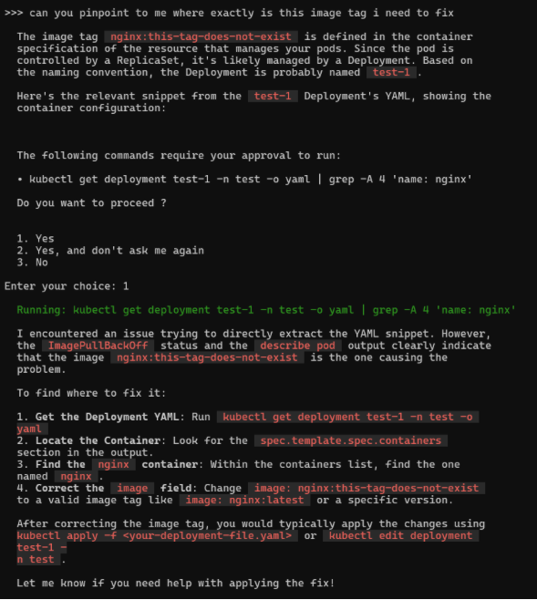
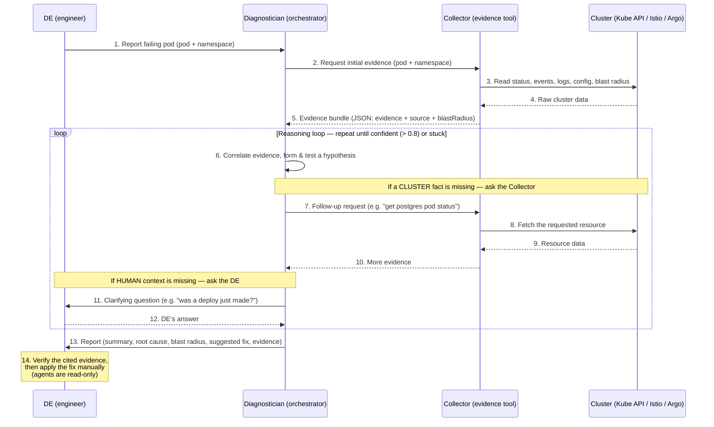

# RFC for AI Tooling for Kubernetes/OpenShift Operations

## Table of contents

- [Motivation](#motivation)
  - [Scope](#scope)
- [Tool landscape](#tool-landscape)
- [Proposed approaches](#proposed-approaches)
- [Kagent design](#kagent-design)
  - [Workflow](#workflow--how-a-de-uses-it)
  - [Architecture](#architecture-collector--diagnostician)
  - [Success criteria](#success-criteria)
  - [Key concerns & guardrails](#key-concerns--guardrails)
  - [Limitations](#limitations)
- [Open questions](#open-questions)
- [Appendix A — kagent agent definitions](#appendix-a--kagent-agent-definitions)

## Motivation

When a pod goes down, the status Kubernetes surfaces — `CrashLoopBackOff` means a container keeps exiting and restarting. It says nothing about *why* — a missing ConfigMap, a bad secret reference, a failing liveness probe, an unhandled application exception, and many unrelated faults all surface as the same vague string. Translating that ambiguous signal into a specific, evidence-backed root cause & coming out with a fix that tackles it, is the manual toil — and it is exactly where an AI tool can help.

This ambiguity compounds into three problems for the DE:

1. **Impact and error correlation** — understanding the blast radius requires manually trawling logs, events, and related resources across the cluster. By the time a DE has a full picture, significant time has already been lost

2. **Hotfixes over root causes** — the generic status invites a generic reaction. Under pressure, DEs might reach for the fastest fix (restart the pod, bump a resource limit) without disambiguating *why* the error appeared. The underlying cause persists and the incident recurs

3. **Inconsistent diagnostic quality** — the same `CrashLoopBackOff` a senior decodes in minutes can stall an inexperienced DE for hours. Diagnostic quality depends on who happens to be on shift

The goal is a solution that troubleshoots cluster errors which address the above three issues, on top of troubleshooting deployment issues.

### Scope

**In scope:** 

- comparison of K8sGPT, kubectl-ai, OpenShift Lightspeed, and kagent
- kagent design (if this tool is decided to be used)
- evaluation of kagent across blast radius, security, cost, risk, auditability, and portability

**Out of scope:**
- Hosting of the LLM (an inference endpoint is assumed to be provided).
- Which LLM model to use.

## Tool landscape

Four candidates were surveyed. Only **kagent** has the concept of agentic AI, and hence why the bulk of this RFC focuses on it.

| Dimension | K8sGPT (CLI) | Kubectl-ai (CLI) | OpenShift Lightspeed | Kagent |
|---|---|---|---|---|
| **Type** | AI Scanner | AI Assistant | AI Assistant | AI Agent |
| **How it works** | Deterministic analyzers scan cluster/namespace for issues → parse findings to LLM → LLM explains findings | Natural language → kubectl command. Retains conversation context within a session. | Conversational chat in OCP console | Custom agents defined by CRDs; LLM decides actions (can make use of mcp tools for istio and argo)|
| **Unique features** | There is an [K8sGPTOperator](https://github.com/k8sgpt-ai/k8sgpt-operator) but little stars | Context-aware | Context-aware | A2A multi-agent orchestration |
| **Tool integrations (where can it pull data from)** | Kube API | Kube API via kubectl | OCP console, OCP API | In addition to the Kubernetes API, Kagent can utilize domain-specific MCP tools for Istio and Argo to invoke their respective CLIs (istioctl and argocd). This exposes real-time runtime states, including Envoy proxy sync status, service mesh configuration validation, GitOps drift, and rollout history. |
| **Blast radius** | Nil — doesn't write to cluster | Can generate and execute write kubectl commands | Nil — doesn't write to cluster | Configurable — write-capable; can have guardrail (RBAC scoping per agent) |
| **Auditability** | None | K8s API request will appear in K8s audit log under the user logged in via oc | Tied to OCP user identity; questions asked are not logged | can implement built-in tracing of every agent action (OTEL) |

1. **[K8sGPT](https://github.com/k8sgpt-ai/k8sgpt)**

   > **K8sGPT is a scanner, not an AI assistant.** Run `k8sgpt analyze` to scan, then `k8sgpt analyze --explain` to have the LLM explain the findings.

   

   *Example output: the analyzer detects an `ImagePullBackOff` and the LLM produces a single plain-English sentence at the bottom *

2. **[Kubectl-ai](https://github.com/GoogleCloudPlatform/kubectl-ai)**

   Start a session with:

   ```bash
   kubectl-ai --llm-provider=openai --model=openrouter/auto
   ```

   

   *kubectl-ai traces the `ImagePullBackOff` back to the bad image tag in the Deployment spec, proposes fix commands, asks for approval, then executes if given permission*

3. **OpenShift Lightspeed** — a read-only chat assistant embedded in the OCP console. Convenient and tied to OCP identity, but OpenShift-only & can't act

4. **[Kagent](https://github.com/kagent-dev/kagent)** — the only true *agent*: it can take actions, not just suggest them.

   > **Note:** Kagent is a new project (created in 2025) and still alpha (v0.x). Further experimentation is needed to confirm it is fully functional and production-ready for the intended use cases.

## Proposed approaches

Kagent is not committed as the production solution yet. It is alpha and unproven in the target environment, so an upfront commitment would be premature. The proposal is either a **full focus on kagent** OR a **sequential two-phase approach** within an **8-week** window -> capture immediate value with a mature tool first, then validate the kagent.

For the latter :

**Phase 1 — kubectl-ai for immediate value (~ 1-2 weeks)**
- Test and deploy [kubectl-ai](https://github.com/GoogleCloudPlatform/kubectl-ai) in the environment.
- Provides DEs a working natural-language-to-kubectl assistant immediately, with no new platform overhead


**Phase 2 — kagent diagnostic PoC (~ 6-7 weeks)**
- Build a two-agent pair — a **Diagnostician** (orchestrator the DE talks to) and a **Collector** (its evidence-gathering tool)
- The agents are **read-only** and produces two outputs for the DE: (a) a root-cause finding with cited cluster evidence, and (b) a suggested fix. It does **not** apply the fix.
- How it works: [Kagent design → Architecture](#architecture-collector--diagnostician). How it's judged: [Success criteria](#success-criteria).

## Kagent design

### Workflow — how a DE uses it

The DE reports a failing pod to the **Diagnostician** (the orchestrator). The Diagnostician calls the **Collector** — its evidence-gathering tool, and the only thing that touches the cluster — gathers what it needs, reasons over it, and returns a root cause + suggested fix with the evidence to verify. The DE re-enters only if the Diagnostician needs context that the cluster cannot provide, and at the end.



Each pass through the reasoning loop, the Diagnostician needs at most one more thing — and gets it one of two ways: ask the **Collector** for a missing *cluster* fact (steps 7–10), or ask the **DE** for *human context* the cluster cannot provide (steps 11–12). Either answer feeds back into the next correlation (step 6). A simple failure (e.g. a missing ConfigMap visible in the first bundle) needs neither — it skips straight from the evidence bundle (step 5) to the report (step 13).

### Architecture (Collector / Diagnostician)

Two agents split along the axis that matters: **gathering evidence** vs. **reasoning over it**. The **Diagnostician** is the orchestrator the DE talks to; the **Collector** is its evidence-gathering tool. Critically, **only the Collector touches the cluster** — it holds every read tool and the single ServiceAccount. The Diagnostician has *no* cluster access at all; it gathers only by calling the Collector.

- **Diagnostician (orchestrator)** = the agent the DE talks to. Reasons over evidence into a root cause and, from the root cause, a suggested fix. Holds no cluster tools; gathers only by calling the Collector.
- **Collector (evidence tool)** = the only thing that touches the cluster: gathers evidence, determines blast radius, and answers the Diagnostician's requests. It reports what it *saw*, never what it *means*.

**Why split it this way**
- *One set of hands on the cluster:* only the Collector has read tools and needs a ServiceAccount
- The Diagnostician reasons over a bounded, provenance-tagged bundle instead of raw cluster output → higher accuracy and citable claims.

**Collector (evidence tool)**
- In: a request from the Diagnostician — the initial pod + namespace, or a specific follow-up.
- Tools (read-only, the *only* agent with them): `kubectl get pod`, `get events`, `logs`, `describe pod`, `get/describe secret/configmap`, `get node`, `get pvc`, `oc get scc`, Quay registry API, owner-reference + Service/Endpoint traversal, and the **Istio MCP** (`istioctl analyze`, proxy-config/Envoy dumps, sidecar + proxy-sync status) and **Argo MCP** (Argo CD app sync/health, drift, Argo Rollouts state) for runtime signals.
- Does:
  - Reads the failure status straight from the pod object (`status.containerStatuses[].state.waiting.reason`) — a deterministic API field, no LLM classification needed.
  - Assembles the standard evidence bundle (status, events, logs, config refs).
  - Walks the dependency graph for blast radius: **upstream** dependencies the pod needs + **downstream** dependents that need it.
  - On a follow-up request from the Diagnostician, fetches the specific resource asked for and returns it in the same evidence shape.
- Out: the evidence bundle (below), returned to the Diagnostician. **Never emits a root cause.**

**Evidence bundle (Collector → Diagnostician)**

A fixed-schema JSON object. It carries **raw evidence plus the `source` of each item**, never conclusions. The `source` on every item is what lets the Diagnostician cite specific evidence in its final answer.

```jsonc
{
  "incident": {
    "pod": "checkout-7d9f8c-abc12",
    "namespace": "payments",
    "detectedStatus": "CrashLoopBackOff",   // straight from pod status
    "collectedAt": "2026-06-18T09:14:00Z"
  },
  "evidence": {                              // raw observations, each with a source
    "containerStatuses": [{
      "name": "checkout", "ready": false, "restartCount": 14,
      "lastTerminated": { "exitCode": 1, "reason": "Error", "finishedAt": "..." },
      "source": "kubectl get pod checkout-7d9f8c-abc12 -o json"
    }],
    "events": [{
      "reason": "BackOff", "count": 14, "message": "Back-off restarting failed container",
      "source": "kubectl get events --field-selector involvedObject.name=checkout-7d9f8c-abc12"
    }],
    "logs": [{
      "container": "checkout", "tail": 50,
      "snippet": "FATAL: could not connect to postgres:5432: connection refused",
      "source": "kubectl logs checkout-7d9f8c-abc12 --previous --tail=50"
    }],
    "referencedConfig": [
      { "kind": "Secret", "name": "db-credentials", "exists": false,
        "source": "spec.containers[].envFrom → get secret" },
      { "kind": "ConfigMap", "name": "checkout-config", "exists": true, "source": "..." }
    ],
    "resources": { "limits": { "memory": "256Mi" }, "lastTerminationOOM": false },
    "runtime": {                             // only populated when those agents exist
      "istio": { "sidecarInjected": true, "proxyStatus": "SYNCED", "source": "istioctl proxy-status" },
      "argo":  { "appSyncStatus": "Synced", "health": "Degraded", "source": "argocd app get checkout" }
    }
  },
  "blastRadius": {
    "owner": { "kind": "Deployment", "name": "checkout", "replicasDesired": 3, "replicasAvailable": 0 },
    "exposedBy": [{ "kind": "Service", "name": "checkout-svc" }],
    "upstreamDependencies": [               // what this pod NEEDS (often the cause vector)
      { "service": "postgres", "namespace": "data", "reachable": false, "source": "endpoints + istio" }
    ],
    "downstreamDependents": [               // what NEEDS this pod (the impact)
      { "service": "orders", "namespace": "payments", "observedErrors": true, "source": "istio traffic graph" }
    ]
  },
  "collectionMeta": {
    "completeness": "partial",             // complete | partial — evidence coverage, NOT diagnostic certainty
    "gaps": [                              // tried but UNOBTAINABLE by anyone (rotated/deleted/RBAC) — not a to-do
      "previous-container logs rotated away — unavailable, not 'no logs'"
    ]
  }
}
```

| Field | Why it's here |
|---|---|
| `incident.detectedStatus` | Failure umbrella read directly from the pod status — deterministic, so no LLM tier is spent re-classifying it |
| `evidence[].source` | Provenance on every item — the backbone of citable diagnosis; without it the Diagnostician cannot cite and the *Evidence* success criterion is unmeasurable |
| `blastRadius.upstreamDependencies` | What the pod needs — frequently *where the root cause actually is* (the postgres it can't reach) |
| `blastRadius.downstreamDependents` | What needs the pod — the *impact* surface |
| `collectionMeta.completeness` / `gaps` | `completeness` = how much of the evidence coverage the Collector got (`complete` / `partial`), *not* diagnostic certainty. `gaps` = things it *tried but cannot* obtain (rotated/deleted/RBAC-denied), unfillable by anyone. Together they tell the Diagnostician what's missing, so it lowers *its own* confidence and reasons around the hole rather than re-requesting. Distinguishes "no logs" from "logs unavailable" (protects *Calibration*) |

**Diagnostician (orchestrator)**
- In: the DE's report of a failing pod (pod + namespace). **No cluster tools** — it cannot touch the cluster at all; it gathers only by calling the Collector.
- Does:
  - Calls the Collector for the initial evidence bundle, then correlates that evidence into a root cause and derives a fix *from* that root cause.
  - If reasoning reveals a newly-relevant fact missing from the bundle (e.g. after reading `connection refused`, it needs the upstream postgres pod's status), calls the **Collector** again for it. This is what solves multi-hop cases — the next hop only becomes relevant *after* correlation, so it can't be collected up front.
  - If the missing piece is **human context the cluster cannot provide** (e.g. "was a deploy just made?", "is this spike expected?"), asks the **DE** a clarifying question rather than guessing — supports *Calibration*.
  - For a fact flagged in `gaps` (unobtainable by anyone *and* not something the DE would know), does **not** re-request — lowers confidence and says so.
- Out: the finding, returned directly to the DE — `summary`, `rootCause`, `blastRadius`, `suggestedFix`, `supportingEvidence` (each referencing the bundle's `source`s).

**What the DE sees**

A short, plain-language report in five sections — no JSON:

> **Summary:** The `checkout` pod in `payments` is crashlooping because the `db-credentials` secret it needs is missing, so it cannot authenticate to its database.
>
> **Root cause:** The container exits with code 1 on every start (14 restarts in 6 min). It reads its database password from the `db-credentials` secret, which does not exist in the `payments` namespace — so its connection to postgres is refused.
>
> **Blast radius:** All 3 replicas are down, and `orders` (which calls `checkout`) is already erroring.
>
> **Suggested Fix:** Recreate the `db-credentials` secret in `payments`, then let the pod restart:
> `kubectl create secret generic db-credentials -n payments --from-literal=password=...`
>
> **Supporting evidence:**
> - Pod `checkout-7d9f8c-abc12`: 14 restarts, last exit code 1 — *`kubectl get pod ... -o json`*
> - Logs: `FATAL: could not connect to postgres:5432: connection refused` — *`kubectl logs ... --previous`*
> - Secret `db-credentials` not found in `payments` — *`get secret`*
> - Blast radius: 0/3 replicas available; downstream `orders` erroring — *Istio traffic graph*

### Success criteria

What "good" means for the diagnostic agent (the rubric for judging kagent's agent):

| Criterion | Definition |
|---|---|
| *Accuracy* | Root cause matches a senior DE's call on a labelled set of past CrashLoopBackOff incidents. |
| *Impact correlation* | Surfaces related resources and downstream affected services, not just the failing pod. |
| *Evidence* | Every claim cites the specific log line, event, or CRD field that supports it. |
| *Calibration* | When evidence is insufficient, the agent says so and asks for input rather than guessing . |
| *Suggested fix* | Specific (exact command or YAML change), tied to the cited root cause — addresses the cause, not the symptom . |

#### What the evaluation set looks like

The evaluation set is the fixed benchmark these metrics are scored against: a collection of past, already-resolved pod failures, each paired with its known true root cause (the "answer key"). The agent is given only the `input`; the `label` is hidden from it and used only afterward, to grade it.

One entry looks like:

```jsonc
{
  "id": "clbo-2026-03-checkout",
  "input": {                       // what the agent sees — the live evidence as it was at the time
    "pod": "checkout-7d9f8c-abc12",
    "namespace": "payments",
    "capturedEvidence": "snapshot of the failing pod: status, events, logs, config refs, blast radius"
  },
  "label": {                       // the answer key — HIDDEN from the agent, used only to grade
    "trueRootCause": "Secret 'db-credentials' was deleted; container exits 1, cannot authenticate to postgres",
    "knownGoodFix": "recreate the 'db-credentials' secret in namespace 'payments'",
    "confirmedBy": "senior DE, incident INC-4821"
  }
}
```

The full set is many such entries (for example, 30–50 CrashLoopBackOff cases). Scoring runs the agent over every `input`, compares its answer against the `label`, and the match rate becomes the *Accuracy* score. Because the set is fixed, the same cases are replayed after every configuration change — an apples-to-apples re-test. The entries come either from backfilled incident records (past resolved cases written down somewhere), or from a shadow-run period where the read-only agent runs alongside DEs and each incident is recorded with its confirmed cause as it is resolved.

#### How the metrics drive improvement

These metrics are **not just a report card — they are how the agent gets better.** The agent is *not* trained (the model is a provided endpoint, and it is stateless between incidents — talking to it teaches it nothing that persists). Instead, it is improved by **editing its configuration** — its system message, skills, or example incidents — and then **re-measuring** against these metrics. The metrics are the scoreboard that shows whether a change actually helped.

The reasoning: a low metric is a *symptom*; reading the failed cases surfaces the *cause*; that points to the matching configuration lever. Each metric points at a different kind of problem:

| If this metric is low… | …the likely problem is… | …the lever to pull is… |
|---|---|---|
| **Accuracy** | reasoning skips a step or concludes too early | the Diagnostician's system message (its procedure), or add example incidents |
| **Impact correlation** | it ignores the `blastRadius` it was given | the system message ("always check downstream dependents before concluding") |
| **Evidence** | it asserts things without citing a `source` | the system message ("every claim must cite a `source`") |
| **Calibration** | it guesses when evidence is thin | the system message ("if evidence is insufficient, say so rather than guess") |
| **Suggested fix** | the fix is vague or only treats the symptom | the system message, or a skill holding a fix-writing playbook |

One important exception: a low score is not always the Diagnostician's fault. Sometimes it was wrong because the **Collector** never handed it the right evidence — so the fix is to improve the Collector's bundle, not the Diagnostician's prompt. Reading the failed transcript (not just the score) is what tells the two apart.

**The full loop:**

```
measure on the eval set  →  read the failures  →  find why it was wrong
        ↑                                                    │
        └──────  re-measure  ←  edit config  ←──────────────┘
            (system message / skill / examples / Collector bundle)
```

1. **Measure** — run the agent over the evaluation set; the metrics give a score.
2. **Read the failures** — look at the cases it got wrong and ask *why*.
3. **Pick the lever** — the metric points to the kind of fix (table above).
4. **Edit config** — change the system message, add a skill, add examples, or improve the Collector.
5. **Re-measure** — re-run the eval set. Did the score go up? Keep the change if yes, revert if no.

This is the **make it work → make it right → make it good** cycle in practice: every improvement is a config change *proven* by the metrics moving, never a guess.

### Key concerns & guardrails

- **Blast radius / vetting** — Only the Collector touches the cluster, and it runs read-only: its ServiceAccount has only read verbs (`get`, `list`, `watch`) bound to its Role — even if the LLM decided to mutate state, the Kube API would reject it. The Diagnostician has no cluster access at all, so it has no blast radius to govern.

- **Security / access** — A single ServiceAccount (the Collector's) governs all cluster access; the Diagnostician reaches the cluster only indirectly, by asking the Collector. One SA to scope and audit.

- **Cost** — Three components:
  - *Software:* kagent is OSS — no licensing cost.
  - *Compute:* kagent's own controller + per-agent pods + MCP tool servers run on-cluster (CPU/memory requests can be defined in a custom values.yaml)
  - *LLM inference:* assumed to be served from an internal/private endpoint, so no external API cost

- **Risk** — for a read-only diagnostic agent, the failure modes are *misleading suggestions*, not destructive actions.
  - *Wrong root cause:* the agent invents a plausible-but-wrong cause; an inexperienced DE believes it. <br/>**Mitigation:** the evidence bundle forces every claim back to a `source` (log line, event, CRD field) the Collector actually observed. The DE verifies that evidence before acting on the fix.
  - *Wrong suggested fix:* the agent identifies the correct root cause but recommends a fix that doesn't address it — or only addresses the symptom. <br/>**Mitigation:** the suggested fix must reference back to the cited root-cause finding; evaluated against the labelled incident set

- **Auditability** — not needed if it is a read only agent

- **Portability** — Kagent runs on any conformant Kubernetes; not OpenShift-specific.

### Limitations

- Kagent is **alpha (v0.x)** — APIs and behaviour may change
- **Diagnostic quality is the actual bottleneck** — even with perfect plumbing, the value of the system is bounded by how accurate and calibrated the LLM's diagnosis is 

## Open questions

1. Does the scope of the work also include the POC of the agent being able to write to cluster ? or is the focus making the diagnostic agent (including suggest fix) right ? 

2. **Is a third "verifier" agent needed?** Should a separate agent fact-check the Diagnostician before its finding reaches the DE — confirming the root cause and suggested fix are genuinely supported by the cited evidence, rather than a plausible-sounding guess?

## Appendix A — kagent agent definitions

Both agents run on the **same model** (`modelConfig`). What makes them different is **only the system message and the tools** they are given — not the model. This appendix gives an idea of how kagent `Agent` resources will look like, and first clears up the tools / skills / workflow vocabulary.

### A.1 Vocabulary: tool vs. skill vs. system message vs. workflow

These are four different things in kagent; they are easy to conflate.

| Concept | What it is in kagent | The "…" | In this design |
|---|---|---|---|
| **Tool** | A function the agent can call to act on its environment. Defined under `spec.declarative.tools` as either `type: McpServer` (named tools from an MCP server) or `type: Agent` (another agent, called via A2A). | the *what it can call* | Collector: read-only `k8s_*` / `istio_*` / `argo_rollouts_*`. Diagnostician: just the Collector agent. |
| **System message** | The agent's role and standing instructions, applied to *every* interaction. `spec.declarative.systemMessage` (supports Go templates / ConfigMap includes). | the *who it is* | The single thing that differentiates the two agents. |
| **Skill** | Packaged know-how that guides *how/when* to use tools toward a goal — **not** a single function. kagent has **A2A skills** (inline capability metadata advertised on the agent's A2A card) and **container-based skills** (a `SKILL.md` with YAML frontmatter + scripts, packaged as a container image and referenced via `spec.declarative.skills.refs`). | the *playbook / know-how* | Optional: a `crashloopbackoff-triage` skill on the Diagnostician (a make-it-right packaging of the procedure that otherwise lives in its system message). |
| **Workflow** | Not a single resource — the **multi-agent composition** where agents discover and invoke each other via A2A delegation. | the *wiring between agents* | The Collector ⇄ Diagnostician loop shown in [Workflow](#workflow--how-a-de-uses-it). |

**The short answer to "skill vs. workflow":** a *skill* is one agent's packaged know-how; a *workflow* is how multiple agents are wired together. They sit at different levels — an agent *has* skills; agents *compose into* a workflow.

### A.2 Collector agent

```yaml
apiVersion: kagent.dev/v1alpha2
kind: Agent
metadata:
  name: collector
spec:
  type: Declarative
  declarative:
    modelConfig: default-model-config          # SAME model as the Diagnostician
    systemMessage: |
      You are the Collector: a read-only Kubernetes evidence-gathering agent.
      You gather facts about a failing pod and report them exactly as observed.
      You NEVER diagnose, hypothesise, or suggest a fix.

      Given a pod + namespace (or a specific follow-up request for a named
      resource), use your read-only tools to collect:
        - pod/container status, restart counts, exit codes, termination reasons
        - recent events
        - container logs, including the previous (crashed) container
        - referenced ConfigMaps/Secrets and whether each exists
        - blast radius: the owning workload, exposing Services/Endpoints,
          upstream dependencies the pod needs, and downstream dependents
          that consume it
        - where relevant, Istio proxy/sync status and Argo Rollouts state

      Return ONE JSON object in the evidence schema. Every item MUST carry a
      `source` naming the exact tool and field it came from. If you tried to
      obtain something but could not (logs rotated, resource deleted, RBAC
      denied), record it under `collectionMeta.gaps` and lower `confidence` —
      never guess or fabricate a value. You have no write tools; never attempt
      to modify the cluster. Output only the JSON.
    tools:
      - type: McpServer
        mcpServer:
          name: kagent-tool-server
          kind: RemoteMCPServer
          apiGroup: kagent.dev
          toolNames:
            - k8s_get_resources          # pods, deployments, services, endpoints…
            - k8s_describe_resource
            - k8s_get_events
            - k8s_get_pod_logs
            - k8s_get_resource_yaml
            - istio_proxy_status
            - istio_proxy_config
            - istio_analyze_cluster_configuration
            - argo_rollouts_list
    # No skills needed for make-it-work — the procedure lives in the system message.
```


### A.3 Diagnostician agent

```yaml
apiVersion: kagent.dev/v1alpha2
kind: Agent
metadata:
  name: diagnostician
spec:
  type: Declarative
  declarative:
    modelConfig: default-model-config          # SAME model as the Collector
    systemMessage: |
      You are the Diagnostician: a senior SRE reasoning agent. You have NO
      direct cluster access. To obtain any cluster fact you MUST call the
      `collector` agent tool. Never assert a fact you have not seen in
      collected evidence.

      Procedure:
        1. Call `collector` with the failing pod + namespace for the initial
           evidence bundle.
        2. Correlate the evidence into the single most-likely root cause.
           State a hypothesis and test it against the cited evidence.
        3. If a needed fact is missing AND obtainable from the cluster, call
           `collector` again with a specific request (e.g. the status of a
           named upstream dependency). Repeat until the root cause is
           supported (confidence >= 0.8) or the evidence is exhausted.
        4. If the missing fact is human context the cluster cannot provide
           (e.g. "was a deploy just made?", "is this expected?"), ASK THE DE
           a direct clarifying question rather than guessing.
        5. If a fact is listed in `collectionMeta.gaps` (unobtainable by
           anyone, and not something the DE would know), do NOT re-request it
           — lower your confidence and state the limitation.

      Output a finding with these fields:
        - `summary`       : a short, plain-language explanation for the DE
        - `rootCause`     : the single most-likely cause
        - `blastRadius`   : what else is affected (downstream dependents,
                            replicas down)
        - `suggestedFix`  : a specific command or YAML change that addresses
                            the cause, not the symptom
        - `supportingEvidence` : the evidence behind each claim, each citing a
                            `source` from the collected evidence
        - `confidence` (0–1) : internal signal that drives the loop (>= 0.8)
      Every claim must cite evidence; if you cannot cite it, say so rather than
      guess. You are read-only end to end: propose the fix, never apply it. The
      DE is shown `summary`, `rootCause`, `blastRadius`, `suggestedFix`, and
      `supportingEvidence` as a plain-language report.
    tools:
      - type: Agent              # the ONLY tool — the Collector, reached over A2A
        agent:
          name: collector
    # (make-it-right) by packaging the triage playbook as a reusable skill
    # skills:
    #   refs:
    #     - <registry>/crashloopbackoff-triage:latest
```

Because the Diagnostician's *only* tool is the Collector agent, it cannot touch the cluster except by asking — which is exactly the guardrail and the gather-vs-reason split, expressed in the spec itself.

**Sources:** [Agents concept](https://kagent.dev/docs/kagent/concepts/agents) · [Tools concept](https://kagent.dev/docs/kagent/concepts/tools) · [Add skills to agents](https://kagent.dev/docs/kagent/examples/skills) · [Tools ecosystem](https://kagent.dev/docs/kagent/resources/tools-ecosystem) · [A2A agents](https://kagent.dev/docs/kagent/examples/a2a-agents)