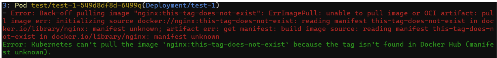

# RFC for AI Tooling for Kubernetes/OpenShift Operations

## Table of contents

- [Motivation](#motivation)
  - [Scope](#scope)
- [Design](#design)
  - [The four tools evaluated](#the-four-tools-evaluated)
  - [Proposal](#proposal)
  - [Kagent: Agent Architecture and Key Concerns](#kagent-agent-architecture-and-key-concerns)
    - [Part 1 — Proposed Architecture (Primary + Secondary Agent pattern)](#part-1--proposed-architecture-primary--secondary-agent-pattern)
    - [Part 2 — Key Agent Concerns](#part-2--key-agent-concerns)
  - [Limitation & concerns](#limitation--concerns)
- [Open questions](#open-questions)

## Motivation

When a pod goes down, a DE faces three compounding problems:

1. **Impact and error correlation** — understanding the blast radius requires manually trawling logs, events, and related resources across the cluster. By the time a DE has a full picture, significant time has already been lost.

2. **Hotfixes over root causes** — under pressure, DEs often reach for the fastest fix (restart the pod, bump a resource limit) without identifying *why* the error appeared. The underlying cause persists and the incident recurs.

3. **Inconsistent diagnostic quality** — the DE changes daily. An inexperienced DE may miss a subtle misconfiguration that a senior would catch immediately. Diagnostic quality today depends on who happens to be on shift.

The goal is a solution that addresses all three: surfacing impact and correlated errors in parallel, digging past symptoms to the true root cause, and providing consistent senior-level diagnosis regardless of who is responding.

This RFC surveys four candidates, then evaluates **kagent** in depth as the only option capable of acting on findings — which is both its value and its risk.

### Scope

**In scope:** 

- comparison of K8sGPT, kubectl-ai, OpenShift Lightspeed, and kagent
- evaluation of kagent across blast radius, security, cost, risk, auditability, and portability

**Out of scope:**
- Hosting of the LLM (an inference endpoint is assumed to be provided).
- Which LLM model to use.

## Design

### The four tools evaluated

| Dimension | K8sGPT (CLI) | Kubectl-ai (CLI) | OpenShift Lightspeed | Kagent |
|---|---|---|---|---|
| **Type** | AI Scanner | AI Assistant | AI Assistant | AI Agent |
| **How it works** | Deterministic analyzers scan cluster/namespace for issues → parse findings to LLM → LLM explains findings | Natural language → kubectl command. Retains conversation context within a session. | Conversational chat in OCP console | Custom agents created by CRDs; LLM decides actions (can make use of mcp tools as well)|
| **Unique features** | There is an operator but little stars | Context-aware | Context-aware | A2A multi-agent orchestration |
| **Tool integrations (where can it pull data from)** | Kube API | Kube API via kubectl | OCP console, OCP API | Via MCP tools. All other tools are limited to the Kube API — they can read CRD specs (e.g. `AuthorizationPolicy`, `Rollout`) but only see **declared config**.<br><br>Kagent's domain MCP tools (Istio, Argo) also invoke the actual CLIs (`istioctl`, `argocd`), exposing **live runtime state**: Envoy proxy sync status, mesh config validation, GitOps drift and rollout history |
| **Blast radius** | Nil — doesn't write to cluster | Can generate and execute write kubectl commands | Nil — doesn't write to cluster | Configurable — write-capable; can have guardrail (RBAC scoping per agent) |
| **Auditability** | None | K8s API request will appear in K8s audit log under the user we oc log in as | Tied to OCP user identity; questions asked are not logged | can implement built-in tracing of every agent action (OTEL) |

1. **[K8sGPT](https://github.com/k8sgpt-ai/k8sgpt)**

   > **K8sGPT is a scanner, not an AI assistant.** Run `k8sgpt analyze` to scan, then `k8sgpt analyze --explain` to have the LLM explain the findings.

   

   *Example output: the analyzer detects an `ImagePullBackOff` and the LLM produces a single plain-English sentence at the bottom *

2. **[Kubectl-ai](https://github.com/GoogleCloudPlatform/kubectl-ai)**

   Start a session with:

   ```bash
   kubectl-ai --llm-provider=openai --model=openrouter/auto
   ```

   

   *kubectl-ai traces the `ImagePullBackOff` back to the bad image tag in the Deployment spec, proposes fix commands, asks for approval, then executes if given permission*

3. **OpenShift Lightspeed** — a read-only chat assistant embedded in the OCP console. Convenient and tied to OCP identity, but OpenShift-only & can't act

4. **[Kagent](https://github.com/kagent-dev/kagent)** — the only true *agent*: it can take actions, not just suggest them. The rest of this RFC focuses here.

   > **Note:** Kagent is a new project (created in 2025) and still alpha (v0.x). Further experimentation is needed to confirm it is fully functional and production-ready for our use cases.

### Proposal

Kagent is not committed as the production solution yet. It is alpha and unproven in the target environment, so an upfront commitment would be premature. The proposal is a **sequential two-track approach** within an **8-week** window — capture immediate value with a mature tool first, then validate the kagent.

**Track 1 — kubectl-ai for immediate value (~ 1-2 weeks)**
- Test and deploy [kubectl-ai](https://github.com/GoogleCloudPlatform/kubectl-ai) in the environment.
- Provides DEs a working natural-language-to-kubectl assistant immediately, with no new platform overhead


**Track 2 — kagent diagnostic PoC (~ 6-7 weeks)**
- Build a **Primary + Secondary** agent targeting **one** failure type — **CrashLoopBackOff** as the starting point.
- The agent is **read-only** and produces two outputs for the DE: (a) a root-cause finding with cited cluster evidence, and (b) a suggested fix. It does **not** apply the fix. Whether write/remediation is in scope is [open question 2](#open-questions).
- The goal is **quality, not coverage** — for the one failure type chosen, the agent's root cause and suggested fix should match what a senior DE would produce. Confirming kagent's A2A orchestration runs on OpenShift is necessary but not sufficient.
- Architecture in [Part 1](#part-1--proposed-architecture-primary--secondary-agent-pattern).

**What "good" means for the diagnostic agent** (success criteria for Track 2)

| Criterion | Definition |
|---|---|
| *Accuracy* | Root cause matches a senior DE's call on a labelled set of past CrashLoopBackOff incidents. |
| *Impact correlation* | Surfaces related resources and downstream affected services, not just the failing pod (addresses [motivation #1](#motivation)). |
| *Evidence* | Every claim cites the specific log line, event, or CRD field that supports it. |
| *Calibration* | When evidence is insufficient, the agent says so and asks for input rather than guessing (addresses [motivation #3](#motivation)). |
| *Suggested fix* | Specific (exact command or YAML change), tied to the cited root cause — addresses the cause, not the symptom (addresses [motivation #2](#motivation)). |

**Decision point** — after both tracks, the question is whether kagent's **diagnostic depth** (multi-agent reasoning + live runtime state via Istio/Argo MCP tools) delivers enough over kubectl-ai to justify operating it. Write capability is a possible future extension, not the immediate value driver.

### Kagent: Agent Architecture and Key Concerns

#### Part 1 — Proposed Architecture (Primary + Secondary Agent pattern)

Two-tier agent design for diagnosing pod failures.

- **Primary** = first responder who arrives at the scene, assesses what kind of incident this is, and briefs the specialist.
- **Secondary** = the specialist who does the actual deep investigation with the full toolkit.

**Primary Agent (Orchestrator)**
- In: pod failure report from DE (pod + namespace). Tools (minimal): `kubectl get pod`, `get events`.
- Classifies failure type (CrashLoopBackOff, ImagePullBackOff, OOMKilled, Pending, CreateContainerConfigError…).
- Out: structured brief --parse to--> Secondary Agent (pod, namespace, failure type, key observation, investigation focus); then synthesises Secondary's findings into final root cause + suggested fix for DE.

**Structured brief (Primary → Secondary)**

A fixed-schema JSON handoff — not free text — so the Secondary Agent receives a focused, machine-parseable starting point rather than raw cluster output:

```json
{
  "pod": "checkout-7d9f8c-abc12",
  "namespace": "payments",
  "failureType": "CrashLoopBackOff",
  "keyObservation": "Container 'checkout' exits with code 1, 14 restarts in 6m",
  "investigationFocus": "Inspect container logs and verify referenced secret/configmap exist"
}
```

| Field | Description |
|---|---|
| `pod` | Failing pod name (from DE report) |
| `namespace` | Pod namespace |
| `failureType` | Classified failure (CrashLoopBackOff, ImagePullBackOff, OOMKilled, Pending, CreateContainerConfigError…) |
| `keyObservation` | The signal that drove the classification (exit code, event reason, restart count) |
| `investigationFocus` | Directs the Secondary Agent to the likely area — narrows its tool use |

**Secondary Agent (Deep Investigator)**
- In: the structured brief. Tools (full set via MCP):
  - Core diagnostics: `kubectl logs`, `describe pod`, `get/describe secret`, `get configmap`, `get events`, `get node`, `get pvc`, `oc get scc`, Quay registry API.
  - **Istio MCP tool** — service-mesh diagnostics beyond plain CRD reads: `istioctl analyze` (mesh config validation), proxy-config / Envoy config dumps, sidecar injection and proxy-sync status.
  - **Argo MCP tool** — GitOps/rollout diagnostics: Argo CD app sync + health status, drift detection, and Argo Rollouts progression/abort state.
- Out: structured root cause finding --parse to --> Primary.

**Why split it**
- Primary stays narrow and fast — only enough context to classify.
- Secondary reasons over a focused brief, not raw cluster output → higher accuracy.
- RBAC scoped per agent; each gets only what it needs.
- New failure patterns = extend Secondary's tool set, Primary untouched.

#### Part 2 — Key Agent Concerns (Context - Diagnostic Agent that can suggest fix)

- **Blast radius / vetting** — Both agents run read-only. The ServiceAccount they run under has only read verbs (`get`, `list`, `watch`) bound to its Role — even if the LLM decided to mutate state, the Kube API would reject it

- **Security / access** — The agent's access to the Kube API is governed by its ServiceAccount RBAC (above)

- **Cost** — Three components:
  - *Software:* kagent is OSS — no licensing cost.
  - *Compute:* kagent's own controller + per-agent pods + MCP tool servers run on-cluster (CPU/memory requests in [`helm/sf-values.yaml`](helm/sf-values.yaml))
  - *LLM inference:* assumed to be served from an internal/private endpoint, so no external API cost

- **Risk** — for a read-only diagnostic agent, the failure modes are *misleading suggestions*, not destructive actions.
  - *Wrong root cause:* the agent invents a plausible-but-wrong cause; an inexperienced DE believes it. **Mitigation:** structured JSON handoffs between Primary and Secondary force the model to cite the specific cluster evidence (log line, event, CRD field) it used. The DE verifies that evidence before acting on the fix.
  - *Wrong suggested fix:* the agent identifies the correct root cause but recommends a fix that doesn't address it — or only addresses the symptom. **Mitigation:** the suggested fix must reference back to the cited root-cause finding; evaluated against the labelled incident set

- **Auditability** — For a diagnostic agent the audit goal is **attribution + feedback** (which DE asked what, what did the agent suggest, was the suggestion followed, did it work) rather than blame-tracing a mutation. A K8s audit log entry shows only the agent's ServiceAccount, not the DE — so a per-DE trail requires stitching three logs:
  1. **Invocation log** (DE-facing layer) — records the DE, the question asked, the agent's root cause + suggested fix, and a correlation ID.
  2. **OTEL trace** (OpenTelemetry, emitted by kagent per agent step) — tagged with the same correlation ID.
  3. **K8s audit log** — read-only Kube API calls under the agent SA.

  *Proposed bridge:* inject the correlation ID into OTEL spans and K8s audit annotations so one ID joins all three trails. Whether kagent natively supports the audit-annotation injection is still to be confirmed.

- **Portability** — Kagent runs on any conformant Kubernetes; not OpenShift-specific.

### Limitation & Concerns

- Kagent is **alpha (v0.x)** — APIs and behaviour may change
- **Diagnostic quality is the actual bottleneck** — even with perfect plumbing, the value of the system is bounded by how accurate and calibrated the LLM's diagnosis is 


## Open questions

1. Does the scope of the work also include the POC of the agent being able to write to cluster ? or is the focus making the diagnostic agent (including suggest fix) right ? 

